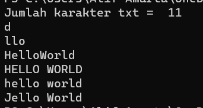
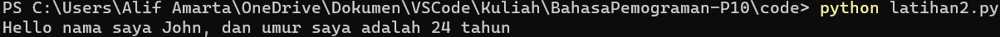

<p align="center"

Nama: Alif Nur Fathlii Amarta

<p align="center"

NIM: 312210326

<p align="center"

Kelas: TI.22.A3


# Latihan1

## Code

    txt = 'Hello World'

Hitung jumlah karakter

    print("Jumlah karakter txt = ",len(txt))

Ambil karakter terakhir 

    print(txt[10])

Ambil karakter index ke-2 sampai ke-4

    print(txt[2:5])

Hilangkan spasi pada text tersebut

    print(txt.replace(' ', ''))

ubah text menjadi huruf besar

    print(txt.upper())

Ubah text menjadi huruf kecil

    print(txt.lower())

Ganti karakter H dengan karakter J

    print(txt.replace('H','J'))

## Output



# Latihan 2

## Code

```
umur = 24

txt = 'Hello nama saya John, dan umur saya adalah {} tahun'

print(txt.format(umur))
```

## Output


